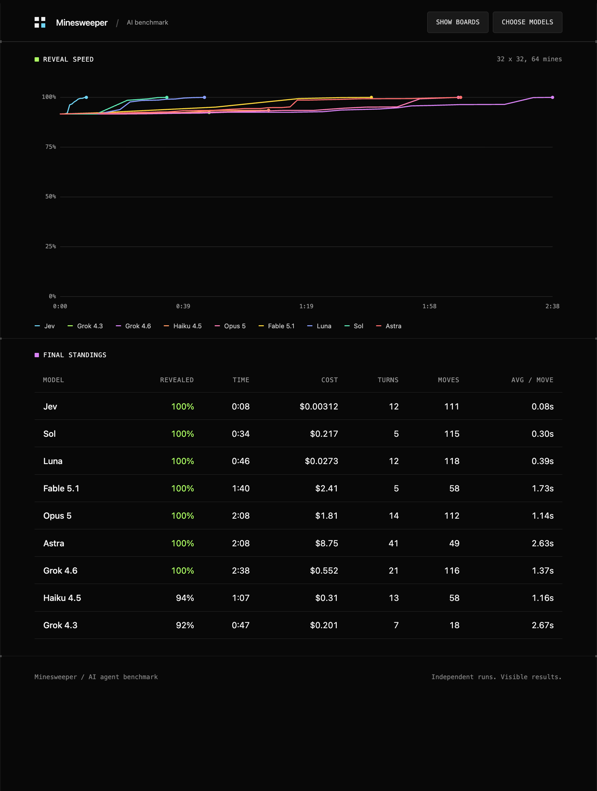

# Minesweeper · AI agent benchmark

<video src="https://github.com/user-attachments/assets/aeb30575-44e8-4a4f-b6e2-0a8ad6558ffe" controls muted playsinline width="100%"></video>

[](#)

Up to nine AI models play Minesweeper side by side, under the same rules and the same tool layer, so
what separates them is the reasoning rather than the setup. One seed builds every lane, so all of
them get the same mines and the same opening square, and they start at the same moment on one
clock, which is what makes the times worth comparing. Each is scored on how much of the board it
uncovered, how long that took and what the tokens cost. The app is plain HTML, local CSS and vanilla
JavaScript with no dependencies and no build step, and it is built to be recorded: the stage shows
only the boards and their figures. When the run ends it charts how fast each model reached a full
reveal and ranks them in a table.

## A run

The summary opens on its own once every model has finished.



**Revealed** is the share of the safe cells a model uncovered, so 100% is a win. **Time** and
**Cost** are read at the end of the run: for a model that wins they are the time and cost of a full
reveal, and for one that does not they still say how far it got and what that took. A **turn** is
one hand-off of the board to the model; a **move** is a call that changed the board, so reading the
frontier three times before acting is not credited as three moves.

## Run it yourself

Node 22 or newer. No install step, no dependencies.

```bash
cp .env.example .env       # then fill in the keys you want to use
node server.mjs            # http://localhost:8787
PORT=9000 node server.mjs  # custom port
```

`.env` takes one key per provider. Leave the rest blank. A model whose key is missing fails with a
clear message and the other lanes keep playing.

```dotenv
TYPESAFE_API_KEY=
ANTHROPIC_API_KEY=
OPENAI_API_KEY=
XAI_API_KEY=
```

Keys stay on the server, which listens only on `127.0.0.1` and proxies every model request itself.
